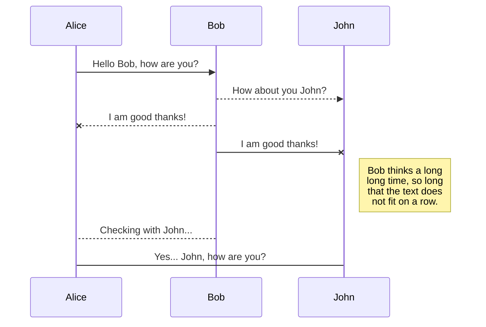
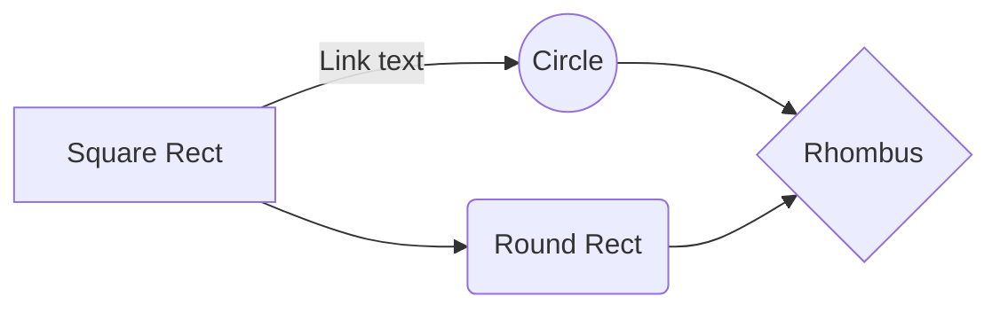

<h1>Cahier des charges</h1>

Par 
>**<b>Firenze AMORIN
Lyes BELKHIRI
Yahia RAHMANI**</b>

Nom du projet : **JH3**
Personne à contacter à l’université: **Julien Hairapian**.
Email : julien.Hairapian@univ-evry.fr

# Sommaire

1.  <a href="#int"> INTRODUCTION </a>
1.1 - Description du document
1.2 - Présentation du contexte  

2. <a href="#obj"> OBJECTIFS ET ENJEUX </a>
2.1 - Objectifs de l'application
2.2 - Cibles  
3. <a href="#graph"> GRAPHISME ET ERGONOMIE </a>
3.1 - Charte graphique
3.2 - Wireframe et maquettage  
4. <a href="#exf"> EXIGENCES FONCTIONNELLES </a>
4.1 - Présentation générale
4.2 - Utilisateurs
4.3 - Fonctionnalités
4.4 - Inventaire des données nécessaires
4.5 - Autres exigences fonctionnelles  
5. <a href="#ext"> EXIGENCES TECHNIQUES </a> 

## <a id="int">I - INTRODUCTION </a>

 <h3>1.1 - Description du document </h3>

Le document a pour but de préciser le besoin vis à vis du projet pour le client. Il spécifie les besoins techniques et fonctionnels de l'application tout en donnant des informations sur le comportement de celle-ci et les possibles implémentation qu'elle peut avoir. 

<h3>1.2 - Présentation du contexte </h3>

Dans le cadre de notre formation Master 1 MIAGE en apprentissage,
nous avons été chargés de créer une application web basée sur le
même principe que le site eBay, mais qui sera une application lite,
c’est-à-dire allégée par rapport l’application originale.
L’objectif principal de ce cahier de charges est d'exprimer les
besoins du client, c’est-à-dire définir les objectifs principaux de notre
application, puis détailler les fonctionnalités que doit fournir notre
application, lister les utilisateurs concernés, et présenter une
première version de notre wireframe. Ce document apporte une
première esquisse de notre projet, ainsi que certains éléments de
réponse qui seront sujets à amélioration.
  

## <a id="obj">II - OBJECTIFS ET ENJEUX </a>

<h3>2.1 - Objectifs de l'application</h3>

Cette application est une application web de ventes aux enchères, ça sera un
moyen de courtage et ça consiste à servir d’intermédiaire entre un acheteur et un
vendeur, et ces services sont à disposition de toute personne inscrite sur le site.
En plus des ventes aux enchères, l’application a pour objectif d’offrir la
possibilité d’achat immédiat, quelque soit l’état de l’objet (neuf, d’occasion, hors
service...).

<h3>2.2 - Cibles </h3>

Nous visons toute personne physique ou morale, professionnel ou particulier,
qui voudrait effectuer une vente d’un objet/article/produit (ou d’un service) ou qui pourrait vouloir acheter un des articles disponibles.  
 

## <a id="graph">III - GRAPHISME ET ERGONOMIE</a>

<h3>3.1 - Charte graphique</h3>
<h4>LE LOGO :</h4>
Pour le site, le client à décidé de choisir ce logo parmi d’autre qui lui ont été
proposés:     
  

<h4>
LES MAQUETTES ET LES COULEURS :</h4>

> les maquettes ne sont pas définitives, elles peuvent être soumises à des modifications par la suite.
> Veillez cliquer sur celles-ci pour visualiser les images.

<h4>WIREFRAME</h4>

Les maquettes sont divisées en 3 parties:  

 - Une première décrivant le comportement d’un utilisateur Administrateur,
- Une seconde se basant sur le comportement d’un utilisateur client
pouvant être vendeur ou enchérisseur (=acheteur) ,
- Une troisième portant sur un utilisateur visiteur.

 
><b>Wireframes Administrateur: </b>  

     

><b>Wireframes Visiteur: </b>  

  
   
  
   

><b>Wireframes Client Vendeur/Enchérisseur: </b>  

     

	

	 
## Delete a file

You can delete the current file by clicking the **Remove** button in the file explorer. The file will be moved into the **Trash** folder and automatically deleted after 7 days of inactivity.

## Export a file

You can export the current file by clicking **Export to disk** in the menu. You can choose to export the file as plain Markdown, as HTML using a Handlebars template or as a PDF.

# Synchronization

Synchronization is one of the biggest features of StackEdit. It enables you to synchronize any file in your workspace with other files stored in your **Google Drive**, your **Dropbox** and your **GitHub** accounts. This allows you to keep writing on other devices, collaborate with people you share the file with, integrate easily into your workflow... The synchronization mechanism takes place every minute in the background, downloading, merging, and uploading file modifications.

There are two types of synchronization and they can complement each other:

- The workspace synchronization will sync all your files, folders and settings automatically. This will allow you to fetch your workspace on any other device.
	> To start syncing your workspace, just sign in with Google in the menu.

- The file synchronization will keep one file of the workspace synced with one or multiple files in **Google Drive**, **Dropbox** or **GitHub**.
	> Before starting to sync files, you must link an account in the **Synchronize** sub-menu.

## Open a file

You can open a file from **Google Drive**, **Dropbox** or **GitHub** by opening the **Synchronize** sub-menu and clicking **Open from**. Once opened in the workspace, any modification in the file will be automatically synced.

## Save a file

You can save any file of the workspace to **Google Drive**, **Dropbox** or **GitHub** by opening the **Synchronize** sub-menu and clicking **Save on**. Even if a file in the workspace is already synced, you can save it to another location. StackEdit can sync one file with multiple locations and accounts.

## Synchronize a file

Once your file is linked to a synchronized location, StackEdit will periodically synchronize it by downloading/uploading any modification. A merge will be performed if necessary and conflicts will be resolved.

If you just have modified your file and you want to force syncing, click the **Synchronize now** button in the navigation bar.

> **Note:** The **Synchronize now** button is disabled if you have no file to synchronize.

## Manage file synchronization

Since one file can be synced with multiple locations, you can list and manage synchronized locations by clicking **File synchronization** in the **Synchronize** sub-menu. This allows you to list and remove synchronized locations that are linked to your file.

# Publication

Publishing in StackEdit makes it simple for you to publish online your files. Once you're happy with a file, you can publish it to different hosting platforms like **Blogger**, **Dropbox**, **Gist**, **GitHub**, **Google Drive**, **WordPress** and **Zendesk**. With [Handlebars templates](http://handlebarsjs.com/), you have full control over what you export.

> Before starting to publish, you must link an account in the **Publish** sub-menu.

## Publish a File

You can publish your file by opening the **Publish** sub-menu and by clicking **Publish to**. For some locations, you can choose between the following formats:

- Markdown: publish the Markdown text on a website that can interpret it (**GitHub** for instance),
- HTML: publish the file converted to HTML via a Handlebars template (on a blog for example).

## Update a publication

After publishing, StackEdit keeps your file linked to that publication which makes it easy for you to re-publish it. Once you have modified your file and you want to update your publication, click on the **Publish now** button in the navigation bar.

> **Note:** The **Publish now** button is disabled if your file has not been published yet.

## Manage file publication

Since one file can be published to multiple locations, you can list and manage publish locations by clicking **File publication** in the **Publish** sub-menu. This allows you to list and remove publication locations that are linked to your file.

# Markdown extensions

StackEdit extends the standard Markdown syntax by adding extra **Markdown extensions**, providing you with some nice features.

> **ProTip:** You can disable any **Markdown extension** in the **File properties** dialog.

## SmartyPants

SmartyPants converts ASCII punctuation characters into "smart" typographic punctuation HTML entities. For example:

|                |ASCII                          |HTML                         |
|----------------|-------------------------------|-----------------------------|
|Single backticks|`'Isn't this fun?'`            |'Isn't this fun?'            |
|Quotes          |`"Isn't this fun?"`            |"Isn't this fun?"            |
|Dashes          |`-- is en-dash, --- is em-dash`|-- is en-dash, --- is em-dash|

## KaTeX

You can render LaTeX mathematical expressions using [KaTeX](https://khan.github.io/KaTeX/):

The *Gamma function* satisfying $\Gamma(n) = (n-1)!\quad\forall n\in\mathbb N$ is via the Euler integral

$$
\Gamma(z) = \int_0^\infty t^{z-1}e^{-t}dt\,.
$$

> You can find more information about **LaTeX** mathematical expressions [here](http://meta.math.stackexchange.com/questions/5020/mathjax-basic-tutorial-and-quick-reference).

## UML diagrams

You can render UML diagrams using [Mermaid](https://mermaidjs.github.io/). For example, this will produce a sequence diagram:

And this will produce a flow chart:

<!--stackedit_data:
eyJoaXN0b3J5IjpbMTk2NDM4Njc0NywxODcwNTM2MDUwLC0yNj
Y1OTkzMTgsLTEyMjQyMjE1MDIsLTI3OTM3NzM0NCwxNjgyNzgz
MDI4LDc4MzExOTczOCw3NTEzMDA4NjAsMTk4NTExNDc3OCwtMT
U0Njc1MDEwNiwtMTU1NDY1NTMwNCwxNzE4MTExMjksLTE5MzM2
OTM4NTVdfQ==
-->